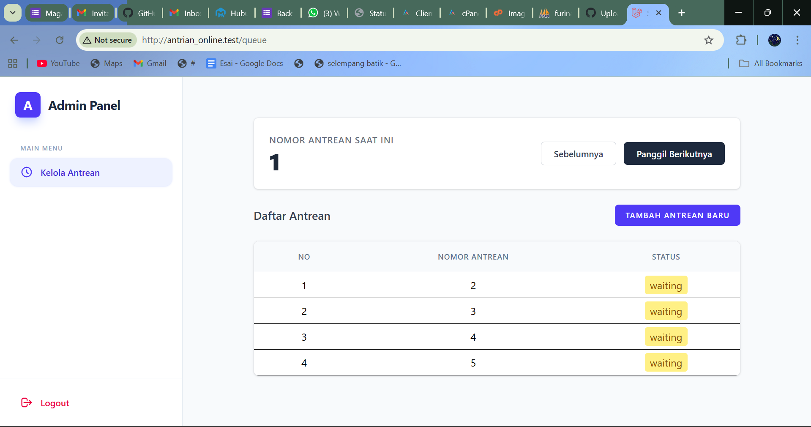
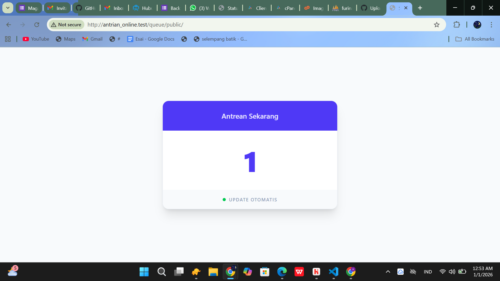

# Antrian Online - Sistem Manajemen Antrian

Sistem antrian online berbasis web yang dikembangkan dengan framework **Laravel**. Proyek ini dirancang untuk memudahkan manajemen antrian secara efisien dan transparan.

## Prasyarat
Sebelum memulai, pastikan Anda telah menginstal:
*   PHP (>= 8.4)
*   Composer
*   MySQL/MariaDB
*   Node.js & NPM (untuk aset frontend)

## Panduan Instalasi (Clone)

Ikuti langkah-langkah berikut untuk menjalankan proyek di komputer lokal Anda:

1.  **Clone Repositori**
    ```bash
    git clone https://github.com/af133/antrian_online.git
    cd antrian_online
    ```

2.  **Instal Dependensi PHP**
    ```bash
    composer install
    ```

3.  **Instal Dependensi Frontend**
    ```bash
    npm install
    npm run dev
    ```

4.  **Konfigurasi Environment**
    Salin file `.env.example` menjadi `.env` dan sesuaikan konfigurasi database Anda.
    ```bash
    cp .env.example .env
    ```

5.  **Generate App Key**
    ```bash
    php artisan key:generate
    ```

6.  **Migrasi Database & Seeding**
    Penting untuk menjalankan perintah ini guna membuat tabel dan mengisi data awal (user admin, pengaturan, dll):
    ```bash
    php artisan migrate --seed
    ```

7.  **Jalankan Server**
    ```bash
    php artisan serve
    ```

## Cuplikan Aplikasi

### Login


### Manajemen Antrian


### Antrian Publik


## Demonstrasi Video


## Fitur Utama
*   Login (admin)
*   Manajemen Antrian (admin)
*   Melihat Nomor Antrian real-time (public/pasien)

---
Dikembangkan oleh [af133](https://github.com/af133).
